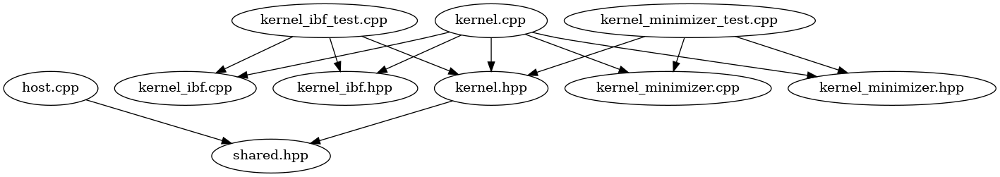
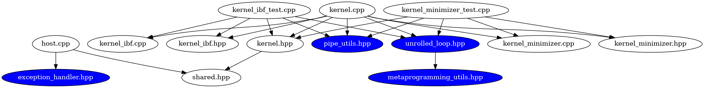

`kernel_*.hpp` contain private functions for the respective `kernel_*.cpp`.\
`kernel_minimizer.cpp` and `kernel_ibf.cpp` contain the actual kernel code.\
`kernel_minimizer_test.cpp`, `kernel_ibf_test.cpp` and `kernel.cpp` put the above mentioned files together and add helper kernels for the tests if necessary.

`shared.hpp` contains code that is shared between host and device.\
`kernel.hpp` only contains code that depends on `WINDOW_SIZE` and `MIN_IBF_K`. All other code is in `shared.hpp`.

(Key (<-): file on the right includes file on the left.)

`shared.hpp` <- `host.cpp`\
`shared.hpp` <- `kernel.hpp` <- `kernel*.cpp`

`exception_handler.hpp`, `metaprogramming_utils.hpp`, `pipe_utils.hpp`, `unrolled_loop.hpp` are copied from the oneAPI examples:

`exception_handler.hpp` <- `host.cpp`\
`metaprogramming_utils.hpp` <- `unrolled_loop.hpp` <- `kernel*.cpp`\
`pipe_utils.hpp` <- `kernel*.cpp`

